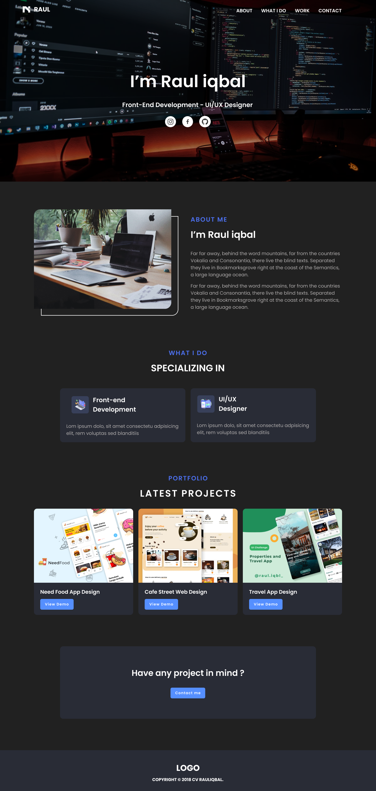

# Your Name's Portfolio



## Overview

This is my personal portfolio built with Next.js, Tailwind CSS, and TypeScript. It showcases my skills, projects, and provides a brief introduction about myself. Feel free to explore and get to know more about me!

## Features

- **Responsive Design**: The portfolio is designed to be responsive and accessible across various devices.
- **Projects Showcase**: Highlighting key projects with descriptions and links to the live demos or GitHub repositories.
- **Skills and Technologies**: Displaying the technologies and skills I am proficient in.
- **Contact Form**: An easy-to-use contact form for reaching out to me.

## Demo

[Live Demo](#)

## Screenshots


## Getting Started

### Prerequisites

Make sure you have Node.js and npm installed on your machine.

### Installation

1. Clone the repository:

```bash
git clone https://github.com/zahid-self/portfolio.git
cd your-portfolio
